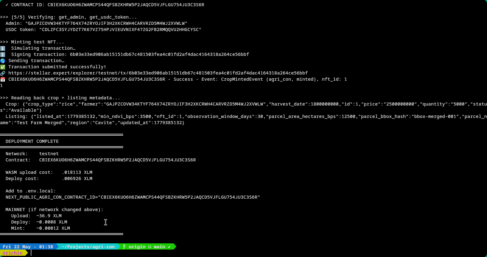

# Agri-Block

## 🧩 Problem

Agricultural forward contracting is broken by information asymmetry. Buyers commit funds for crops they cannot verify exist or are healthy. Farmers wait weeks for payment after delivery with no recourse when buyers default. Manual NDVI reports cost hundreds of dollars per parcel, take days to produce, and can be forged. Paper contracts leave no audit trail. Smallholder farmers — who produce over 70% of the world's food — are shut out of formal commodity markets entirely.

## 🌟 Vision

A world where every harvest is pre-sold with confidence. Where a farmer in a rural province can mint their crop as a verifiable NFT, prove its health with free satellite data, and receive upfront payment in seconds — not months. Where buyers anywhere on earth can browse verified crop listings, check real NDVI scores, and purchase knowing their funds are protected by code, not promises.

## 🎯 Purpose

We built Agri-Block because the gap between what satellite data can prove and what agricultural markets currently trust is enormous. Copernicus Sentinel-2 images the entire planet every 5 days at 10m resolution — completely free. Stellar settles transactions in under 5 seconds for fractions of a cent with native USDC. Combined, these technologies can replace the entire trust-dependent apparatus of crop trading with verifiable, automated, and transparent infrastructure. That's what Agri-Block does.

## 👥 Target Users

- **Smallholder Farmers** — Register land, run free satellite health checks, mint Crop NFTs, receive 20% upfront USDC with 70% in escrow until delivery. No papers, no middlemen, no waiting.
- **Commodity Buyers** — Browse verified listings with real NDVI scores and AI health summaries. Purchase with USDC knowing escrow protects your funds until delivery is verified.
- **Validators** — Insurance providers and third-party inspectors who verify delivery outcomes (Delivered, Disaster, Fraud) and trigger automated escrow settlement.

## ✨ Features

- **Satellite-Gated Crop NFTs** — Every listing requires passing a real-time Copernicus Sentinel-2 NDVI check via openEO. Vegetation health is provable, not claimed.
- **On-Chain USDC Escrow (70/20/10)** — Purchases are split programmatically: 70% held in escrow until verified delivery, 20% upfront to farmer, 10% to farmer aid pool.
- **Forward Contract Marketplace** — Browse, filter, and compare crop listings with live NDVI health rings, AI summaries, and full provenance.
- **Interactive Parcel Explorer** — Draw polygons on Google Maps, bookmark parcels, and run satellite verification with one click. Results include automatic AI analysis.
- **Farmer ID Verification** — Government ID upload to Google Cloud Storage with on-chain profile attestation via Soroban.
- **Proof-Based Aid Claims** — Farmers submit disaster evidence for treasury compensation. Validators adjudicate. Escrow refunds are automated.
- **AI Crop Analysis** — NVIDIA Llama 3.3 70B generates plain-language NDVI summaries and harvest recommendations after every satellite check.
- **Wallet-Agnostic** — Connect via Freighter, Albedo, Lobstr, or WalletConnect through Stellar Wallets Kit.

## 🛠️ Tech Stack

- **Frontend:** Next.js 16, React 19, Tailwind CSS v4, GSAP, Lucide React
- **Backend:** Express 4, Prisma 6 (PostgreSQL 16), sharp (GeoTIFF processing)
- **Blockchain:** Stellar (Soroban SDK 25.0.1, @stellar/stellar-sdk 13.3, Stellar Wallets Kit 2.2)
- **Satellite Data:** Copernicus Sentinel-2 via openEO (Sentinel Hub)
- **AI:** NVIDIA Llama 3.3 70B (ndvi-summary), Google Gemini (fallback)
- **Storage:** Google Cloud Storage (farmer ID documents)
- **Deployment:** Vercel (frontend), Render (backend)

## 🚀 How to Run Locally

```bash
git clone https://github.com/rylsherdamz-rgb/agri-con.git
cd agri-con
npm install
cp .env .env.local
npm run dev
```

Open [http://localhost:3000](http://localhost:3000).

## 🌐 Deployment

### Testnet (Stellar Testnet)

Three Soroban smart contracts deployed and verified:

| Contract | Address |
|---|---|
| Crop NFT | `CCA2E4OOZOR2NLAL2XEWE3KDHTTPDEBWOUX3BMR5QLOITWHOKWKULULR` |
| Escrow | `CDMKYC3VBHZJZMTEN6FQPFKG6LRYXIYOIP5KHEOPGSWCCYRSYXJSZFOQ` |
| Verification | `CA3NIAKLHQN3SKNBUGSWLOZRWY4BNNSKWCPI2BJIHZGYZM4J3QLW4GSA` |

USDC Token: `CDLZFC3SYJYDZT7K67VZ75HPJVIEUVNIXF47ZG2FB2RMQQVU2HHGCYSC`

📸 Stellar Expert — Crop NFT Contract


### Mainnet

Not yet deployed. Targeting mainnet after testnet validation and auditor review.

## 🎥 Demo

- 🔗 **Live App:** [https://agri-con.vercel.app](https://agri-con-one.vercel.app)
    **Demo Video:** [https://drive.google.com/file/d/1fC30xbL83Zp3TbBVPNc2dasBVJP7s4Ct/view?usp=sharing](https://drive.google.com/file/d/1fC30xbL83Zp3TbBVPNc2dasBVJP7s4Ct/view?usp=sharing)
- 🖼️ **Pitch Deck:** [Presentation.pdf](./public/Presentation.pdf)

## 📂 Project Structure

```txt
agri-con/
├── contracts/                    # Soroban smart contracts (Rust workspace)
│   ├── crop_nft/                 # Crop NFT minting & listing
│   ├── escrow/                   # USDC escrow (70/20/10 split)
│   └── verification/             # Satellite attestations & validators
├── app/                          # Next.js 16 App Router
│   ├── marketplace/              # Browse & purchase verified crop listings
│   ├── explore/                  # Interactive parcel map + satellite verification
│   ├── dashboard/                # Farmer & buyer asset overview
│   ├── order/                    # Order tracking & escrow settlement
│   ├── aid/                      # Farmer disaster claims
│   ├── profile/                  # Farmer ID verification
│   └── api/                      # Route handlers (stellar, openeo, ai, verification, farmer-id)
├── components/                   # React components
│   ├── SatelliteVerificationPanel.tsx  # NDVI check + AI summary
│   ├── CheckOutComponent.tsx     # Marketplace purchase flow
│   ├── HeroComponent.tsx         # GSAP animated hero
│   ├── NFTLifecycleFlow.tsx      # 6-step crop lifecycle
│   ├── ParcelMap.tsx             # Google Maps parcel selection
│   └── stellar/                  # Wallet context & connect button
├── lib/stellar/                  # Tx builders, live data queries, network config
├── backend/                      # Express REST API + Prisma (PostgreSQL)
└── package.json
```

## 👨‍💻 Team

| Name | Role | GitHub |
|---|---|---|
| Richie Christian De Guzman | Full-Stack & Smart Contract Developer | [@rylsherdamz-rgb](https://github.com/rylsherdamz-rgb) |

## 📜 License

MIT License
