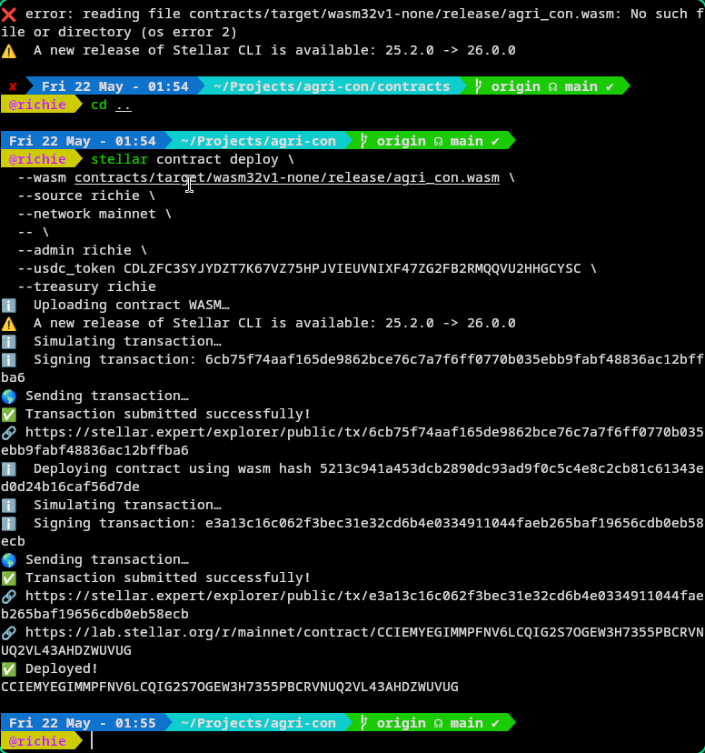

# Agri-Block

## 🧩 Problem
Agricultural forward contracting is broken by information asymmetry. Buyers commit funds for crops they cannot verify exist or are healthy. Farmers wait weeks for payment after delivery with no recourse when buyers default. Manual NDVI reports cost hundreds of dollars per parcel, take days to produce, and can be forged. Paper contracts leave no audit trail. Smallholder farmers — who produce over 70% of the world's food — are shut out of formal commodity markets entirely.
## 🌟 Vision

A world where every harvest is pre-sold with confidence. Where a farmer in a rural province can mint their crop as a verifiable NFT, prove its health with free satellite data, and receive upfront payment in seconds — not months. Where buyers anywhere on earth can browse verified crop listings, check real NDVI scores, and purchase knowing their funds are protected by code, not promises.
## 🎯 Purpose

We built Agri-Block because the gap between what satellite data can prove and what agricultural markets currently trust is enormous. Copernicus Sentinel-2 images the entire planet every 5 days at 10m resolution — completely free. Stellar settles transactions in under 5 seconds for fractions of a cent with native USDC. Combined, these technologies can replace the entire trust-dependent apparatus of crop trading with verifiable, automated, and transparent infrastructure. That's what Agri-Block does.

## 📖 Project Description

Agri-Block is a decentralized forward-contract marketplace for agricultural commodities. It connects farmers directly with buyers by replacing paper contracts, manual inspections, and delayed payments with satellite-verified Crop NFTs, on-chain USDC escrow, and AI-powered crop health analysis.

### How It Works

1. **Farmers register their land** on the interactive parcel explorer, drawing field boundaries on Google Maps and uploading government ID for on-chain verification.
2. **Satellite verification runs on demand** — Copernicus Sentinel-2 imagery is processed via openEO to compute NDVI (Normalized Difference Vegetation Index), proving crop health is real, not claimed.
3. **AI analysis interprets the data** — NVIDIA Llama 3.3 70B generates plain-language health summaries and harvest recommendations so farmers and buyers understand the numbers without agronomic expertise.
4. **Crop NFTs are minted on Stellar** — each listing becomes a verifiable on-chain asset with provenance, NDVI history, and ownership records.
5. **Buyers purchase with USDC** — payments split programmatically: 20% upfront to the farmer, 70% held in escrow until verified delivery, and 10% contributed to a farmer aid pool.
6. **Validators confirm delivery outcomes** — third-party inspectors (insurance providers, agricultural agencies) verify whether crops were Delivered, Lost to Disaster, or involved in Fraud. Escrow releases automatically based on their attestations.
7. **Disaster-affected farmers claim aid** — proof-based claims with satellite evidence trigger treasury compensation, protecting smallholders from climate risk.

### Core Value Proposition

| Traditional System | Agri-Block |
|---|---|
| Manual NDVI reports cost $100s, take days | Free, instant satellite verification |
| Paper contracts, no audit trail | On-chain smart contracts, fully transparent |
| Farmers wait weeks for payment | 20% upfront, remainder in verifiable escrow |
| No recourse when buyers default | Escrow protects both parties, code-enforced |
| Smallholders excluded from formal markets | Permissionless — anyone with land and a phone |
| Crop health claims are unverifiable | NDVI data is public, timestamped, and immutable |

## 👥 Target Users

- **Smallholder Farmers** — Register land, run free satellite health checks, mint Crop NFTs, receive 20% upfront USDC with 70% in escrow until delivery. No papers, no middlemen, no waiting.
- **Commodity Buyers** — Browse verified listings with real NDVI scores and AI health summaries. Purchase with USDC knowing escrow protects your funds until delivery is verified.
- **Validators** — Insurance providers and third-party inspectors who verify delivery outcomes (Delivered, Disaster, Fraud) and trigger automated escrow settlement.

## ✨ Features

- **Satellite-Gated Crop NFTs** — Every listing requires passing a real-time Copernicus Sentinel-2 NDVI check via openEO. Vegetation health is provable, not claimed.
- **On-Chain USDC Escrow (70/20/10)** — Purchases are split programmatically: 70% held in escrow until verified delivery, 20% upfront to farmer, 10% to farmer aid pool.
- **Forward Contract Marketplace** — Browse, filter, and compare crop listings with live NDVI health rings, AI summaries, and full provenance.
- **Interactive Parcel Explorer** — Draw polygons on Google Maps, bookmark parcels, and run satellite verification with one click. Results include automatic AI analysis.
- **Farmer ID Verification** — Government ID upload to Google Cloud Storage with on-chain profile attestation via Soroban.
- **Proof-Based Aid Claims** — Farmers submit disaster evidence for treasury compensation. Validators adjudicate. Escrow refunds are automated.
- **AI Crop Analysis** — NVIDIA Llama 3.3 70B generates plain-language NDVI summaries and harvest recommendations after every satellite check.
- **Wallet-Agnostic** — Connect via Freighter, Albedo, Lobstr, or WalletConnect through Stellar Wallets Kit.

## 🛠️ Tech Stack

- **Frontend:** Next.js 16, React 19, Tailwind CSS v4, GSAP, Lucide React
- **Backend:** Express 4, Prisma 6 (PostgreSQL 16), sharp (GeoTIFF processing)
- **Blockchain:** Stellar (Soroban SDK 25.0.1, @stellar/stellar-sdk 13.3, Stellar Wallets Kit 2.2)
- **Satellite Data:** Copernicus Sentinel-2 via openEO (Sentinel Hub)
- **AI:** NVIDIA Llama 3.3 70B (ndvi-summary), Google Gemini (fallback)
- **Storage:** Google Cloud Storage (farmer ID documents)
- **Deployment:** Vercel (frontend), Render (backend)

## 🚀 How to Run Locally

```bash
git clone https://github.com/rylsherdamz-rgb/agri-con.git
cd agri-con
npm install
cp .env .env.local
npm run dev
```

Open [http://localhost:3000](http://localhost:3000).

## 🌐 Deployment

### Testnet (Stellar Testnet)

Three Soroban smart contracts deployed and verified:

| Contract | Address |
|---|---|
| Crop NFT | `CCA2E4OOZOR2NLAL2XEWE3KDHTTPDEBWOUX3BMR5QLOITWHOKWKULULR` |
| Escrow | `CDMKYC3VBHZJZMTEN6FQPFKG6LRYXIYOIP5KHEOPGSWCCYRSYXJSZFOQ` |
| Verification | `CA3NIAKLHQN3SKNBUGSWLOZRWY4BNNSKWCPI2BJIHZGYZM4J3QLW4GSA` |
| Mainnet | `CCIEMYEGIMMPFNV6LCQIG2S7OGEW3H7355PBCRVNUQ2VL43AHDZWUVUG` |

USDC Token: `CDLZFC3SYJYDZT7K67VZ75HPJVIEUVNIXF47ZG2FB2RMQQVU2HHGCYSC`

📸 Stellar Expert — Crop NFT Contract


Stellar Account


### Mainnet



## 🎥 Demo

- 🔗 **Live App:** [https://agri-con.vercel.app](https://agri-con-one.vercel.app)
    **Demo Video:** [https://drive.google.com/file/d/1EwNXFKI3atXG2BgoWjiF1JYBmg4HaYS6/view?usp=sharing](https://drive.google.com/file/d/1EwNXFKI3atXG2BgoWjiF1JYBmg4HaYS6/view?usp=sharing)
- 🖼️ **Pitch Deck:** [Presentation.pdf](./public/Presentation.pdf)

## 📂 Project Structure

```txt
agri-con/
├── contracts/                    # Soroban smart contracts (Rust workspace)
│   ├── crop_nft/                 # Crop NFT minting & listing
│   ├── escrow/                   # USDC escrow (70/20/10 split)
│   └── verification/             # Satellite attestations & validators
├── app/                          # Next.js 16 App Router
│   ├── marketplace/              # Browse & purchase verified crop listings
│   ├── explore/                  # Interactive parcel map + satellite verification
│   ├── dashboard/                # Farmer & buyer asset overview
│   ├── order/                    # Order tracking & escrow settlement
│   ├── aid/                      # Farmer disaster claims
│   ├── profile/                  # Farmer ID verification
│   └── api/                      # Route handlers (stellar, openeo, ai, verification, farmer-id)
├── components/                   # React components
│   ├── SatelliteVerificationPanel.tsx  # NDVI check + AI summary
│   ├── CheckOutComponent.tsx     # Marketplace purchase flow
│   ├── HeroComponent.tsx         # GSAP animated hero
│   ├── NFTLifecycleFlow.tsx      # 6-step crop lifecycle
│   ├── ParcelMap.tsx             # Google Maps parcel selection
│   └── stellar/                  # Wallet context & connect button
├── lib/stellar/                  # Tx builders, live data queries, network config
├── backend/                      # Express REST API + Prisma (PostgreSQL)
└── package.json
```

## 👨‍💻 Team

| Name | Role | GitHub |
|---|---|---|
| Richie Christian De Guzman | Full-Stack & Smart Contract Developer | [@rylsherdamz-rgb](https://github.com/rylsherdamz-rgb) |

## 🔮 Future Scope

Agri-Block is built to scale. The following roadmap outlines near-term milestones and long-term research areas we believe can transform agricultural commodity markets globally.

### Near-Term (Next 6–12 Months)

- **Mobile-First Farmer App** — A lightweight progressive web app optimized for low-bandwidth, low-end devices so farmers in remote areas can register land, run NDVI checks, and mint Crop NFTs from any smartphone.
- **Multi-Language Support (i18n)** — Localize the entire platform into Swahili, Hindi, Spanish, French, and Bahasa Indonesia to serve the world's largest smallholder farming communities.
- **Expanded Satellite Indices** — Beyond NDVI, integrate EVI (Enhanced Vegetation Index), NDWI (Water), and soil moisture data from SMAP/ESA to provide comprehensive crop health and drought-risk assessments.
- **Batch Verification** — Enable validators to verify entire growing regions in a single transaction, reducing gas costs and speeding up settlement for large-scale buyers.
- **Crop Price Oracles** — Integrate real-world commodity price feeds (FAO, USDA, local market APIs) to help farmers set competitive listing prices and buyers assess fair value.

### Medium-Term (1–2 Years)

- **Crop-Backed Lending Protocol** — Allow farmers to borrow USDC against verified, healthy crops still in the ground. Satellite health data serves as collateral confidence — if NDVI drops below a threshold, terms adjust automatically.
- **Carbon Credit Integration** — Tokenize verified sustainable farming practices (no-till, cover cropping, agroforestry) as on-chain carbon credits. Buyers purchasing crops from carbon-positive farms earn credits alongside their commodities.
- **Supply Chain Tracking** — Extend the NFT lifecycle beyond the farm gate: transport, warehousing, processing, and retail. Each step appends an immutable custody record to the Crop NFT.
- **Insurance Marketplace** — Partner with microinsurance providers to offer parametric crop insurance triggered automatically by satellite data — no claims adjuster needed. If NDVI falls below a threshold for 10+ days, payout initiates.
- **DAO Governance** — Transition platform parameters (escrow splits, validator staking requirements, aid pool disbursement criteria) to community governance via a token-weighted voting system.

### Long-Term Research (2+ Years)

- **Multi-Chain Expansion** — Bridge Crop NFTs and escrow contracts to additional L1/L2 networks (Ethereum, Solana, Polygon) to access deeper liquidity pools and broader buyer markets.
- **IoT Sensor Integration** — Fuse satellite data with ground-truth IoT sensors (soil moisture probes, weather stations, drone imagery) for centimeter-resolution crop monitoring.
- **AI-Powered Yield Prediction** — Train models on historical NDVI, weather, and harvest data to forecast yield 30/60/90 days before harvest. Buyers can hedge with greater precision; farmers can secure better forward prices.
- **Decentralized Identity for Farmers** — Build a self-sovereign identity standard (W3C DID/VC compatible) so a farmer's verification, crop history, and creditworthiness travel across platforms, not just Agri-Block.
- **Climate Resilience Index** — Publish an open, verifiable index tracking agricultural climate impact by region using the platform's accumulated satellite data — useful for policymakers, researchers, and climate funds allocating adaptation resources.

## 📜 License

MIT License
