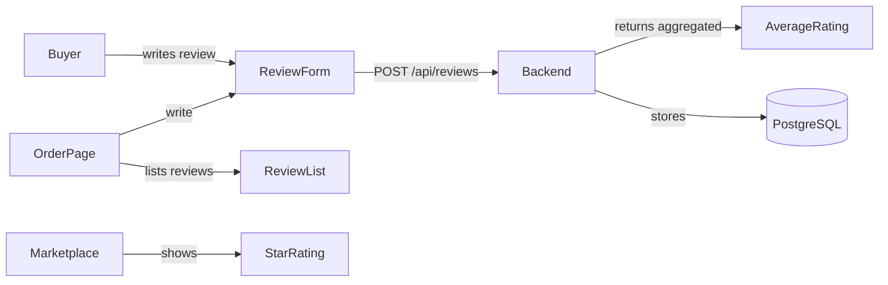

# ⭐ Review System

The **Review System** adds buyer feedback to the Agri-Block marketplace, enabling trust through transparent ratings and written reviews after settlement.

## Architecture



## Data Model

Added to Prisma schema (`backend/prisma/schema.prisma`):

- **Review**: `orderId` | `reviewer` (wallet) | `farmerId` | `rating` (1–5) | `comment` | `createdAt`
- Unique constraint: one review per order per reviewer
- Cascading delete with Order model

## Components

| Component | Location | Purpose |
|-----------|----------|---------|
| `StarRating` | `components/StarRating.tsx` | Display (read-only) + input (interactive) star widget |
| `ReviewForm` | `components/ReviewForm.tsx` | Modal form for writing a review (rating + optional comment) |
| `ReviewList` | `components/ReviewList.tsx` | List of reviews for a farmer (compact + expandable) |

## API Endpoints (Backend)

- `POST /api/reviews` — Create a review (`orderId`, `reviewer`, `farmerId`, `rating`, `comment?`)
- `GET /api/reviews?farmerId=X` — List reviews for a farmer
- `GET /api/reviews/rating/:farmerId` — Get average rating + count for a farmer

## Frontend Integration

### Order Page (`/order`)
- Settled orders show "Leave a Review" button
- After review: shows existing review inline
- Farmer's overall rating shown in expanded order view
- Compact `ReviewList` shows recent reviews

### Marketplace (`/marketplace`)
- Listing cards show farmer's average star rating
- Rating + count displayed next to farmer address badge

## Constraints
- Rating required (1–5); comment optional (max 500 chars)
- One review per order per reviewer (unique constraint in DB)
- Reviews only available after settlement (`buyable === true`)

## Setup

After pulling, run migration on the backend database:
```bash
cd backend
npx prisma migrate dev --name add_reviews
```

Backend automatically picks up the new endpoints on restart.

---

#Marketplace #Trust #Feedback #OnChain
