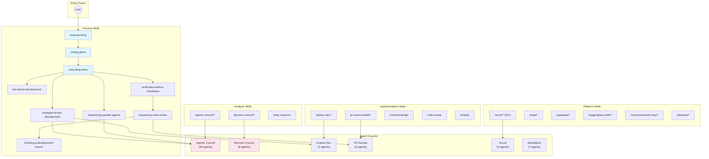

# Superpowers Ecosystem: Full Capability Graph

> Auto-generated reference mapping all skills, councils, agents, and their interrelationships.
> Built 2026-06-19.

---

## 1. Architecture Overview

The ecosystem has three layers:

```
┌─────────────────────────────────────────────────────────────────┐
│                        SKILLS (Top Level)                        │
│  Invoked via Skill tool or /slash-command. Entry point for all   │
│  structured workflows. Skills may call agents as sub-processes.  │
├─────────────────────────────────────────────────────────────────┤
│                      AGENTS (Execution Layer)                     │
│  Launched via Agent tool. Each has a specific lens/expertise.    │
│  Agents do the actual work: review, design, analyze, verify.     │
├─────────────────────────────────────────────────────────────────┤
│                      WORKFLOWS (Orchestration)                    │
│  Scripts that compose agents into deterministic pipelines.       │
│  Fan-out, verify, synthesize. Used for large-scale tasks.        │
└─────────────────────────────────────────────────────────────────┘
```

---

## 2. Skill Taxonomy

### 2.1 Process & Workflow (superpowers)

The backbone — these determine HOW work gets done.

| Skill | Role | Calls Agents? |
|---|---|---|
| `brainstorming` | Turn ideas into designs via collaborative dialogue | → writing-plans |
| `writing-plans` | Create detailed implementation plans from approved specs | → executing-plans |
| `executing-plans` | Execute implementation plans step-by-step | All |
| `test-driven-development` | Red-green-refactor cycle (rigid) | Craftsman |
| `systematic-debugging` | Structured debugging process (rigid) | Explore |
| `subagent-driven-development` | Decompose & dispatch to parallel subagents | All |
| `dispatching-parallel-agents` | Fan-out independent work to multiple agents | All |
| `verification-before-completion` | Verify changes work before declaring done | verify, code-review |
| `requesting-code-review` | Request review from pr-review-toolkit agents | pr-review-toolkit |
| `receiving-code-review` | Process and apply code review feedback | — |
| `finishing-a-development-branch` | Clean up, push, create PR | — |
| `using-git-worktrees` | Isolated git worktrees for parallel work | — |
| `using-superpowers` | Meta: how to use the skills system itself | — |
| `writing-skills` | Create new skills | skill-creator |

**Process Flow:**
```
brainstorming → writing-plans → executing-plans → verification-before-completion
                                      ↕
                            subagent-driven-development
                            dispatching-parallel-agents
                            test-driven-development
                                      ↓
                            requesting-code-review → receiving-code-review
                                      ↓
                            finishing-a-development-branch
```

### 2.2 Multi-Perspective Analysis (agentic-council)

Orchestrated multi-agent analysis across specialized lenses.

**Council Orchestration:**
| Skill | Purpose |
|---|---|
| `brainstorm` | Brainstorm with council lenses |
| `council` | Full council analysis session |
| `deepen` | Deep-dive into a specific topic with council |
| `ship` | Ship/validate council output |
| `handover` | Hand off council findings |

**Thematic Councils:**
| Skill | Lenses Involved |
|---|---|
| `finance-council` | Comptroller (maestro), Controller, FP&A, Treasurer, Tax, Auditor, Capital, RegRep |
| `people-council` | Chair (maestro), PeopleOps, PeoplePartner, Talent, TotalRewards, LearnDev, DEI |
| `revenue-council` | Quartermaster (maestro), AE, SDR, Herald, Strategist |

**Individual Council Lenses (60+ specialized skills):**

| Council Member | Lens Color | Domain | Specialized Skills |
|---|---|---|---|
| **Steward** | Platinum | Orchestration (Maestro) | — |
| **Advocate** | Green | UX, product, accessibility | a11y-audit, i18n-review, interaction-design, journey-mapping |
| **AE** | Crimson | Deal mechanics, MEDDPICC | — |
| **Alchemist** | Indigo | Data engineering, ML | ml-workflow, pipeline-design, schema-evaluation |
| **Architect** | Blue | System design, APIs | api-design, codebase-context, distributed-patterns, schema-design |
| **Artisan** | Rose | Visual design, motion | design-system-architecture, motion-design, visual-audit |
| **Auditor** | Onyx | Internal controls, SOX | — |
| **Capital** | Indigo | M&A, valuation | — |
| **Chair** | Linen | People orchestration | — |
| **Chronicler** | Ivory | Documentation, onboarding | adr-template, changelog-design, documentation-plan |
| **Cipher** | Obsidian | Cryptography, protocol security | crypto-review, pqc-readiness, protocol-analysis |
| **Comptroller** | Verdigris | Finance orchestration | — |
| **Controller** | Forest | GAAP/IFRS, reconciliation | — |
| **Craftsman** | Purple | DX, testing, code quality | e2e-testing, pattern-analysis, testing-strategy |
| **DEI** | Plum | Belonging, accessibility | — |
| **FP&A** | Sky | Forecasting, variance | — |
| **Guardian** | Silver | Compliance, privacy | audit-trail-design, compliance-review, data-classification |
| **Herald** | Bronze | Growth, monetization | growth-engineering, messaging-strategy, monetization-design |
| **LearnDev** | Teal | L&D, career frameworks | — |
| **Operator** | Orange | DevOps, infra, monitoring | cost-analysis, deployment-plan, finops-analysis, observability-design |
| **Oracle** | Violet | AI/LLM, RAG, prompts | ai-evaluation, prompt-engineering, rag-architecture |
| **Pathfinder** | Coral | Mobile, cross-platform | device-integration, navigation-design, platform-audit |
| **PeopleOps** | Slate | HRIS, payroll | — |
| **PeoplePartner** | Sage | Employee relations | — |
| **Prover** | Pearl | Formal methods, verification | formal-spec, invariant-analysis |
| **Quartermaster** | Cobalt | Revenue orchestration | — |
| **RegRep** | Slate | SEC, regulatory | — |
| **Scout** | Cyan | Research, external knowledge | competitive-analysis, enterprise-search-strategy, library-evaluation, technology-radar |
| **SDR** | Amber | Outbound prospecting | — |
| **Sentinel** | Titanium | IoT, embedded, edge | embedded-architecture, fleet-management, protocol-design |
| **Skeptic** | Red | Risk, devil's advocate | edge-case-enumeration, failure-mode-analysis, threat-model |
| **Strategist** | Gold | Business value, MVP | analytics-design, impact-estimation, mvp-scoping |
| **Talent** | Coral | Recruiting, sourcing | — |
| **Tax** | Mustard | Tax, transfer pricing | — |
| **TotalRewards** | Gold | Compensation, equity | — |
| **Treasurer** | Bronze | Cash, liquidity | — |
| **Tuner** | Amber | Performance, optimization | caching-strategy, load-modeling, performance-audit |
| **Warden** | Slate | OS kernel security | hw-sw-boundary, isolation-review, kernel-hardening |

**Finance-specific skills:** close-checklist, controls-audit, journal-entries, reconciliation, tax-research, variance-analysis

### 2.3 Decision Analysis (decision-council)

Structured multi-perspective decision making.

| Skill | Purpose |
|---|---|
| `convene` | Full council session for a decision |
| `council-framework` | Framework reference for structuring decisions |
| `debrief` | Post-session analysis and dashboard |
| `quick` | Abbreviated decision analysis |

**Decision Council Agents:**
| Agent | Role |
|---|---|
| **chairman** | Convene, orchestrate, synthesize recommendation |
| **behaviourist** | Audit reasoning quality, detect cognitive bias (process role) |
| **optimist** | Strongest honest case for upside |
| **pessimist** | Stress-test downside risk and failure modes |
| **devil-advocate** | Challenge all positions, especially consensus |
| **pragmatist** | Assess implementation reality and execution risk |
| **mirror** | Deliver brutal truth chairman softened (confrontational) |
| **debrief** | Post-session dashboard and analysis |

### 2.4 Code Review (pr-review-toolkit)

Multi-dimensional code review pipeline.

| Skill | Purpose |
|---|---|
| `review-pr` | Orchestrate full PR review across all dimensions |
| `code-reviewer` | Style, guidelines, best practices |
| `code-simplifier` | Clarity, consistency, maintainability |
| `comment-analyzer` | Comment accuracy, completeness, rot detection |
| `pr-test-analyzer` | Test coverage quality and completeness |
| `silent-failure-hunter` | Error handling, fallback behavior, suppressed errors |
| `type-design-analyzer` | Type encapsulation, invariants, usefulness |

### 2.5 Feature Development (feature-dev)

| Skill/Agent | Role |
|---|---|
| `feature-dev` | Orchestrate feature development |
| `code-architect` | Design feature architecture from codebase patterns |
| `code-explorer` | Trace execution paths, map architecture layers |
| `code-reviewer` | Review for bugs, logic, security, code quality |

### 2.6 Platform-Specific Skills

**Vercel (30+ skills):**
```
bootstrap → deploy → env → status
ai-gateway, ai-sdk, auth, chat-sdk
deployments-cicd, env-vars, knowledge-update
microfrontends, next-cache-components, next-forge, next-upgrade
nextjs, react-best-practices, routing-middleware, runtime-cache
shadcn, turbopack, vercel-agent, vercel-cli, vercel-connect
vercel-firewall, vercel-functions, vercel-sandbox, vercel-storage
verification, workflow
```

**Vercel Agents:** ai-architect, deployment-expert, performance-optimizer

**Stripe:**
```
explain-error, test-cards, connect-recommend
stripe-best-practices, stripe-directory, stripe-projects, upgrade-stripe
```
**Stripe Agent:** Company Researcher

**Supabase:** supabase, supabase-postgres-best-practices

**HuggingFace (20 skills):**
```
hf-cli, hf-mem, huggingface-best, huggingface-community-evals
huggingface-datasets, huggingface-gradio, huggingface-llm-trainer
huggingface-local-models, huggingface-lora-space-builder
huggingface-paper-publisher, huggingface-papers, huggingface-spaces
huggingface-tool-builder, huggingface-trackio, huggingface-vision-trainer
huggingface-zerogpu, train-sentence-transformers, transformers-js, trl-training
```

**Chrome DevTools MCP:** a11y-debugging, chrome-devtools, chrome-devtools-cli, debug-optimize-lcp, memory-leak-debugging, troubleshooting

**Atlassian:** capture-tasks-from-meeting-notes, generate-status-report, search-company-knowledge, spec-to-backlog, triage-issue

### 2.7 Standalone Skills

| Skill | Purpose |
|---|---|
| `deep-research` | Fan-out web search, verify claims, synthesize cited report |
| `frontend-design` | Frontend UI design and implementation |
| `code-review` | Review diff for correctness bugs and cleanups |
| `simplify` | Review changed code for reuse/simplification |
| `verify` | Verify code change works by running the app |
| `claude-api` | Reference for Claude API / Anthropic SDK |
| `run` | Launch and drive the project's app |
| `init` | Initialize project setup |
| `review` | Review code changes |
| `security-review` | Security-focused code review |
| `loop` | Run a prompt on a recurring interval |
| `update-config` | Configure Claude Code settings.json |
| `keybindings-help` | Customize keyboard shortcuts |
| `fewer-permission-prompts` | Add allowlists to reduce prompts |
| `claude-md-management` | Revise/improve CLAUDE.md files |
| `agent-sdk-dev` | Create new Agent SDK applications |
| `skill-creator` | Create new skills |
| `telegram` | Telegram integration (access, configure) |

---

## 3. Agent Type Taxonomy

### 3.1 By Council

```
agentic-council/ (38 agents)
├── Steward (Platinum) — Maestro
├── Advocate (Green) — UX, product, a11y
├── AE (Crimson) — Deal mechanics
├── Alchemist (Indigo) — Data/ML
├── Architect (Blue) — System design
├── Artisan (Rose) — Visual design
├── Auditor (Onyx) — Controls
├── Capital (Indigo) — M&A
├── Chair (Linen) — People Maestro
├── Chronicler (Ivory) — Docs
├── Cipher (Obsidian) — Crypto
├── Comptroller (Verdigris) — Finance Maestro
├── Controller (Forest) — GAAP
├── Craftsman (Purple) — Code quality
├── DEI (Plum) — Belonging
├── FP&A (Sky) — Forecasting
├── Guardian (Silver) — Compliance
├── Herald (Bronze) — Growth
├── LearnDev (Teal) — L&D
├── Operator (Orange) — DevOps
├── Oracle (Violet) — AI/LLM
├── Pathfinder (Coral) — Mobile
├── PeopleOps (Slate) — HRIS
├── PeoplePartner (Sage) — ER
├── Prover (Pearl) — Formal methods
├── Quartermaster (Cobalt) — Revenue Maestro
├── RegRep (Slate) — SEC
├── Scout (Cyan) — Research
├── SDR (Amber) — Prospecting
├── Sentinel (Titanium) — IoT
├── Skeptic (Red) — Risk
├── Strategist (Gold) — Business
├── Talent (Coral) — Recruiting
├── Tax (Mustard) — Tax
├── TotalRewards (Gold) — Comp
├── Treasurer (Bronze) — Treasury
├── Tuner (Amber) — Performance
└── Warden (Slate) — Kernel security

decision-council/ (8 agents)
├── chairman — Orchestrator
├── behaviourist — Bias detector
├── optimist — Upside case
├── pessimist — Downside case
├── devil-advocate — Consensus challenger
├── pragmatist — Reality check
├── mirror — Brutal truth
└── debrief — Dashboard

feature-dev/ (3 agents)
├── code-architect — Design blueprints
├── code-explorer — Deep analysis
└── code-reviewer — Bug/security review

pr-review-toolkit/ (6 agents)
├── code-reviewer — Style review
├── code-simplifier — Simplification
├── comment-analyzer — Comment audit
├── pr-test-analyzer — Test coverage
├── silent-failure-hunter — Error handling
└── type-design-analyzer — Type design

vercel/ (3 agents)
├── ai-architect — AI apps
├── deployment-expert — Deploy strategy
└── performance-optimizer — CWV/perf

Standalone agents:
├── Explore — Read-only search
├── general-purpose — Catch-all
├── Plan — Architecture planning
├── claude-code-guide — Docs Q&A
├── code-simplifier — Standalone simplifier
├── statusline-setup — Config
└── stripe:Company Researcher — Connect integration
```

### 3.2 By Function (Cross-Cutting)

```
ORCHESTRATION
├── Steward, Chair, Comptroller, Quartermaster (council maestros)
├── chairman (decision maestro)
└── Plan (architecture planning)

ANALYSIS & DESIGN
├── Architect, Strategist, Scout, Chronicler
├── code-architect, code-explorer
└── type-design-analyzer

CODE QUALITY & REVIEW
├── Craftsman, Skeptic
├── code-reviewer (×2), code-simplifier (×2)
├── comment-analyzer, pr-test-analyzer
├── silent-failure-hunter, type-design-analyzer

SECURITY
├── Cipher, Guardian, Prover, Warden, Skeptic

PERFORMANCE
├── Tuner, Operator
└── performance-optimizer

AI/ML
├── Oracle, Alchemist
└── ai-architect

DEPLOYMENT & INFRA
├── Operator
└── deployment-expert

BUSINESS & REVENUE
├── AE, SDR, Herald, Strategist
├── FP&A, Treasurer, Controller, Tax, Auditor, Capital, RegRep

PEOPLE & TALENT
├── PeopleOps, PeoplePartner, Talent, TotalRewards, LearnDev, DEI

UX & DESIGN
├── Advocate, Artisan, Pathfinder

RESEARCH
├── Scout, Explore
└── deep-research (skill)
```

---

## 4. Relationship Graph (Mermaid)



---

## 5. Skill Invocation Priority

When multiple skills could apply, use this order:

1. **Process skills first** — brainstorming, systematic-debugging determine HOW
2. **Analysis skills second** — agentic-council, decision-council for multi-perspective
3. **Implementation skills third** — feature-dev, pr-review-toolkit, platform skills

**Red Flag Check:** Before acting, ask: "Might any skill apply?" Even 1% chance = invoke it.

---

## 6. For This Project (Agri-Block)

The most relevant skills for Agri-Block development:

| Context | Skills to Use |
|---|---|
| Planning features | brainstorming → writing-plans |
| Implementing | executing-plans, subagent-driven-development, TDD |
| Code review | requesting-code-review → pr-review-toolkit |
| Architecture | feature-dev:code-architect, agentic-council:Architect |
| Security (smart contracts) | agentic-council:Cipher, Skeptic, Prover |
| Performance | agentic-council:Tuner, Operator |
| AI features (NVIDIA Llama) | agentic-council:Oracle, Alchemist |
| Frontend (Next.js 16) | frontend-design, vercel:nextjs |
| Deployments (Vercel) | vercel:deploy, vercel:env |
| Stripe/Stellar payments | stripe:stripe-best-practices |